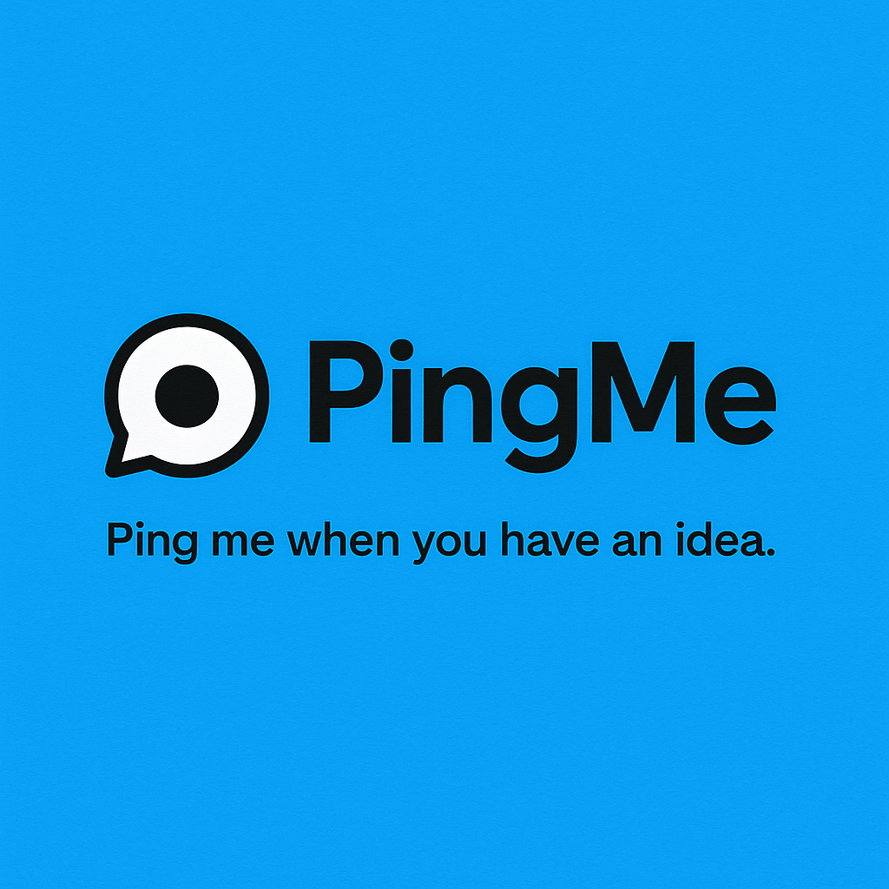

<p align="center">
  
</p>

# PingMe

PingMe is a new social network inspired by X (formerly Twitter) and Threads. It lets you share posts of up to **500 characters**. If you need a bit more space to complete your idea or reasoning, you can request an extra **100 characters**.

Swearing is not allowed, encouraging users to be creative in expressing their messages. You can use `#` for hashtags and `@` to mention people. By using the combination `?@`, you can view a list of your most recent posts and select one to complement your current post or reply.

**Features:**
- Post messages (up to 500 characters, or 600 with extension)
- No swearing allowed (for more creative communication)
- Hashtags (`#`) and mentions (`@`)
- Use `?@` to quickly find and extend your recent posts
- Upload images
- Like, comment, and repost functionality

> **Note:** Many features are still under development, but the core idea is live! Would you like to join and contribute?

---

## Getting Started with Docker

After cloning the repository, you can quickly get both the frontend and backend up and running with Docker.

### 1. Clone the repository

```bash
git clone https://github.com/marcellopato/pingme.git
cd pingme
```

### 2. Start the project

Make sure you have [Docker](https://www.docker.com/) and [Docker Compose](https://docs.docker.com/compose/) installed.

```bash
docker-compose up -d
```

This command will start both the frontend and backend containers.

### 3. Access the application

- **Frontend:** [http://localhost:3000](http://localhost:3000) (or the port specified in your configuration)
- **Backend API:** [http://localhost:8000](http://localhost:8000) (or the port specified in your configuration)

---

## Contributing

Contributions are welcome! If you have suggestions or want to help develop new features, feel free to open an issue or pull request.

---

## License

This project is licensed under the MIT License.

---
